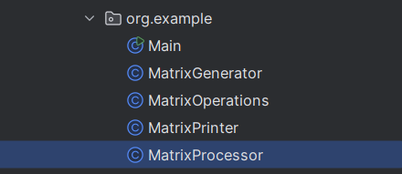

# Лабораторна робота №1

## Тема: Масиви в мові програмування Java

### Мета
- Ознайомлення з масивами та використанням основних методів їх обробки в мові програмування Java.
- Здобуття навичок використання масивів для виконання різних операцій з даними.

---

## Завдання

### 1. Визначення параметрів
1. Визначити значення параметрів:
    - **C5** — остача від ділення номера студента на 5.
    - **C7** — остача від ділення номера студента на 7.
    - **C11** — остача від ділення номера студента на 11.

### 2. Дії з матрицями в залежності від C5
| **C5** | **Операція**                                      |
|-------|---------------------------------------------------|
| 0     | C = aB , де a — константа                          |
| 1     | C = B^T (транспонування)                           |
| 2     | C = A + B                                          |
| 3     | C = A ⊕ B (побітове виключне АБО)                  |
| 4     | C = A × B (матричний добуток)                      |

### 3. Визначення типу елементів матриці за C7
| **C7** | **Тип елементів** |
|--------|-------------------|
| 0      | double            |
| 1      | byte              |
| 2      | short             |
| 3      | int               |
| 4      | long              |
| 5      | char              |
| 6      | float             |

### 4. Обробка результуючої матриці С залежно від C11
| **C11** | **Дія з матрицею С**                                                                                  |
|---------|------------------------------------------------------------------------------------------------------|
| 0       | Обчислити суму найменших елементів кожного стовпця матриці                                            |
| 1       | Обчислити суму найменших елементів кожного рядка матриці                                              |
| 2       | Обчислити суму найбільших елементів кожного стовпця матриці                                            |
| 3       | Обчислити суму найбільших елементів кожного рядка матриці                                              |
| 4       | Обчислити суми найбільших елементів у парних рядках та найменших у непарних                            |
| 5       | Обчислити суми найбільших елементів у непарних рядках та найменших у парних                            |
| 6       | Обчислити суми найбільших елементів у парних стовпцях та найменших у непарних                          |
| 7       | Обчислити суми найбільших елементів у непарних стовпцях та найменших у парних                          |
| 8       | Знайти середнє значення елементів кожного рядка матриці                                                |
| 9       | Знайти середнє значення елементів кожного стовпця матриці                                              |
| 10      | Знайти середнє значення всіх елементів матриці                                                         |

---

## Інструкція з виконання

1. Згенерувати матриці A і B із заданим типом елементів відповідно до значення C7.
2. Виконати обрану операцію над матрицями A і B, залежно від значення C5.
3. Провести обробку результуючої матриці C згідно з дією для C11.
4. Вивести на екран результати першої та другої дій.
5. Обробити всі виключні ситуації, що можуть виникнути під час виконання коду.
6. Дотримуватись стандартів написання коду (Google Java Style Guide).

---

## Результати роботи програми

### Приклад запуску програми

**Вхідні дані:**
- Номер студента: 2324 (Де ІК-23 номер групи і 24 номер в списку)
- C5 = 4, C7 = 0, C11 = 8

### Скриншоти виконання програми
1. **Генерація матриць A і B:**

2. **Результати обчислень (матриця C):**

3. **Обробка матриці C:**

### Код програми знаходить в `src/main/java/org/example`
