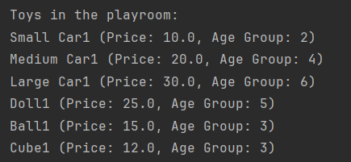
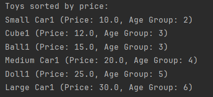
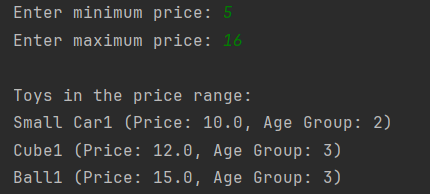

## Лабораторна робота №5

### Тема: Наслідування та поліморфізм

### Мета
- Ознайомлення з механізмом наслідування та принципом поліморфізму в Java.
- Реалізація ієрархії класів для вирішення конкретної задачі.
- Застосування поліморфізму для обробки об’єктів.

---

## Завдання

### 1. Визначення параметра C13
1. Обчислити **C13** — остачу від ділення номера студента на 13.

### 2. Вибір варіанту завдання за C13
| **C13** | **Тема завдання**                                                                                   |
|--------|------------------------------------------------------------------------------------------------------|
| 12     | Ігрова кімната для дітей. Іграшки різних типів. Сортування та фільтрація за параметрами.              |

### 3. Реалізація завдання
- Створити ієрархію іграшок (**Toy** → (**Car** → **SmallCar**, **MediumCar**, **LargeCar**), **Doll**, **Ball**, **Cube**).
- Підготувати ігрову кімнату для дітей різних вікових груп.
- Додати можливість сортування іграшок за параметрами (вартість, тип тощо).
- Знайти іграшку в кімнаті, що відповідає заданому діапазону вартості.

---

## Опис роботи програми

Програма створює ієрархію іграшок:

1. **Toy** — базовий клас із загальними властивостями (назва, ціна, вікова група).

2. **Car** — клас, що описує машинки.
    - Наслідує базовий клас **Toy**.
    - Має три підкласи для розмірів машинок:
        - **SmallCar** — маленькі машинки.
        - **MediumCar** — середні машинки.
        - **LargeCar** — великі машинки.

3. **Doll** — клас, що описує ляльки.
    - Наслідує базовий клас **Toy**.

4. **Ball** — клас, що описує м’ячі.
    - Наслідує базовий клас **Toy**.

5. **Cube** — клас, що описує кубики.
    - Наслідує базовий клас **Toy**.

### Особливості роботи:
- Іграшки поділяються за типами та розмірами.
- Програма підтримує введення даних з консолі для фільтрації іграшок за діапазоном вартості.
- Сортування іграшок відбувається за ціною у порядку зростання.
- Виводиться список усіх іграшок до та після сортування.
- Реалізовано обробку виняткових ситуацій при введенні даних.

### Приклад взаємодії з користувачем:
1. Введення початкових даних і відображення списку іграшок.
2. Введення діапазону цін для пошуку іграшок у межах зазначених вартостей.
3. Виведення списку іграшок у вибраному діапазоні.

Програма підтримує введення початкових даних з консолі та обробляє помилки введення.

---

## Результати роботи програми

### Приклад запуску програми

**Вхідні дані:**
- Кількість іграшок: **6**
- Вартість від: **5**
- Вартість до: **16**

**Вивід програми:**
Initial toys:
```
----------------------------------------
Name            | Type          | Price | Age Group
----------------------------------------
Small Car1      | Small Car     | 10.0  | 2+
Medium Car1     | Medium Car    | 20.0  | 4+
Large Car1      | Large Car     | 30.0  | 6+
Doll1           | Doll          | 25.0  | 5+
Ball1           | Ball          | 15.0  | 3+
Cube1           | Cube          | 12.0  | 3+
----------------------------------------

Sorted toys by price:
----------------------------------------
Small Car1      | Small Car     | 10.0  | 2+
Cube1           | Cube          | 12.0  | 3+
Ball1           | Ball          | 15.0  | 3+
Medium Car1     | Medium Car    | 20.0  | 4+
Doll1           | Doll          | 25.0  | 5+
Large Car1      | Large Car     | 30.0  | 6+
----------------------------------------

Toys in price range [5.0 - 16.0]:
----------------------------------------
Small Car1      | Small Car     | 10.0  | 2+
Cube1           | Cube          | 12.0  | 3+
Ball1           | Ball          | 15.0  | 3+
----------------------------------------
```

### Скриншоти виконання програми
1. **Введення даних:**


2. **Результати сортування:**


3. **Результати пошуку:**


### Код програми знаходить в `src/main/java/org/example`


---

## Інструкції для запуску

### Встановлення та компіляція
1. Завантажити проект з GitHub: [Посилання на репозиторій](https://github.com/eliz-yarko/Java-SD/tree/main/Laboratory5)
2. Відкрити проект у середовищі IntelliJ IDEA.
3. Виконати команду Maven для збирання:
```
mvn clean install
```

### Запуск програми
1. Запустити програму з IntelliJ IDEA через кнопку **Run**.
2. Або виконати команду в терміналі (знаходячись у кореневій директорії):
```
java -cp target/lab5-java-inheritance.jar org.example.Main
```

---

## **Додатково:**

### **Вимоги до стандартів:**
- Код відповідає стандартам **Google Java Style Guide**.
- Присутні коментарі для класів, методів та основних логічних блоків коду.
- Передбачена обробка винятків.