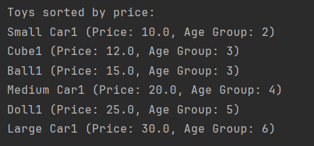
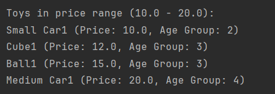
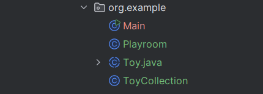

## Лабораторна робота №6

### Тема: Робота з колекціями в мові програмування Java

---

## **Мета:**
- Ознайомлення з інтерфейсами та структурами даних у Java.
- Здобуття навичок створення власних та використання стандартних колекцій.
- Реалізація методів роботи з колекціями: сортування, фільтрація, пошук.


---

## **Завдання:**

### **1. Параметри варіанта:**
1. **C2** = 2324 % 2 = **0** → Інтерфейс **List**.
2. **C3** = 2324 % 3 = **2** → Внутрішня структура — **двозв’язний список**.

### **2. Реалізація колекції:**
- Колекція реалізує інтерфейс **List**.
- Внутрішня структура колекції заснована на **двозв’язному списку**.
- Типом об'єктів колекції є узагальнені класи з Лабораторної роботи №5 (**Toy**, **Car**, **Doll**, **Ball**, **Cube**).

---

## **Опис роботи програми:**

Програма реалізує ієрархію іграшок із лабораторної роботи №5:
1. **Toy** — базовий клас із загальними властивостями (назва, ціна, вікова група).
2. **Car** — клас, що описує машинки (підкласи: **SmallCar**, **MediumCar**, **LargeCar**).
3. **Doll** — клас, що описує ляльки.
4. **Ball** — клас, що описує м’ячі.
5. **Cube** — клас, що описує кубики.

### Особливості роботи:
- Колекція реалізує інтерфейс **List** і побудована на основі **двозв’язного списку**.
- Програма підтримує введення даних з консолі для фільтрації іграшок за діапазоном вартості.
- Сортування іграшок відбувається за ціною у порядку зростання.
- Виводиться список усіх іграшок до та після сортування.
- Реалізовано обробку виняткових ситуацій при введенні даних.

---

## **Результати роботи програми**

### **Приклад запуску:**

**Вхідні дані:**
- Мінімальна ціна: **10.0**
- Максимальна ціна: **20.0**

**Вивід програми:**
```
Initial toys:
----------------------------------------
Name            | Type          | Price | Age Group
----------------------------------------
Small Car1      | Small Car     | 10.0  | 2+
Medium Car1     | Medium Car    | 20.0  | 4+
Large Car1      | Large Car     | 30.0  | 6+
Doll1           | Doll          | 25.0  | 5+
Ball1           | Ball          | 15.0  | 3+
Cube1           | Cube          | 12.0  | 3+
----------------------------------------

Total price of toys: 112.0

Sorted toys by price:
----------------------------------------
Small Car1      | Small Car     | 10.0  | 2+
Cube1           | Cube          | 12.0  | 3+
Ball1           | Ball          | 15.0  | 3+
Medium Car1     | Medium Car    | 20.0  | 4+
Doll1           | Doll          | 25.0  | 5+
Large Car1      | Large Car     | 30.0  | 6+
----------------------------------------

Toys in price range [10.0 - 20.0]:
----------------------------------------
Small Car1      | Small Car     | 10.0  | 2+
Cube1           | Cube          | 12.0  | 3+
Ball1           | Ball          | 15.0  | 3+
Medium Car1     | Medium Car    | 20.0  | 4+
----------------------------------------
```

### **Скриншоти виконання програми:**
1. **Введення даних:**  
   
2. **Результати сортування:**  
   
3. **Результати пошуку:**  
   

### Код програми знаходить в `src/main/java/org/example`

---

## **Інструкції для запуску:**

### **Встановлення та компіляція:**
1. Завантажити проект з GitHub:  
   [Посилання на репозиторій](https://github.com/eliz-yarko/Java-SD/tree/main/Laboratory6)
2. Відкрити проект у середовищі **IntelliJ IDEA**.
3. Виконати команду Maven для збирання:
```
mvn clean install
```

### **Запуск програми:**
1. Запустити програму через IntelliJ IDEA, натиснувши **Run**.
2. Або виконати команду в терміналі (перебуваючи в кореневій директорії):
```
java -cp target/lab6-java-collections.jar org.example.Main
```

---

## **Додатково:**

### **Вимоги до стандартів:**
- Код відповідає стандартам **Google Java Style Guide**.
- Присутні коментарі для класів, методів та основних логічних блоків коду.
- Передбачена обробка винятків.